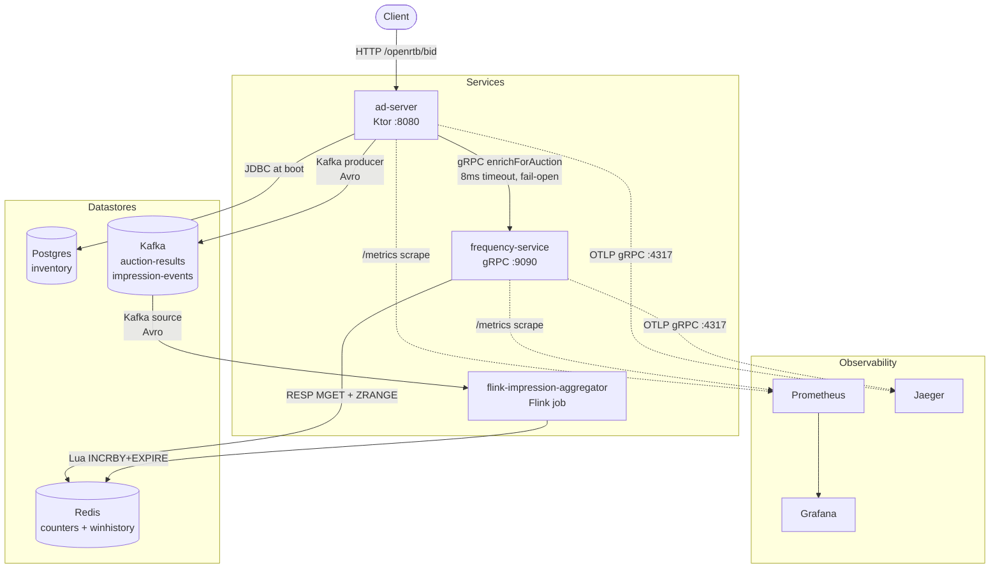
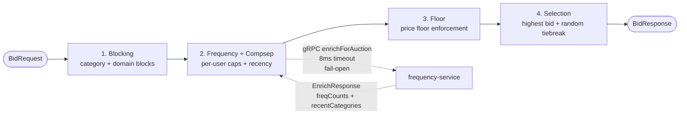
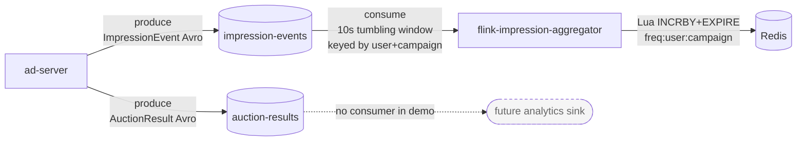
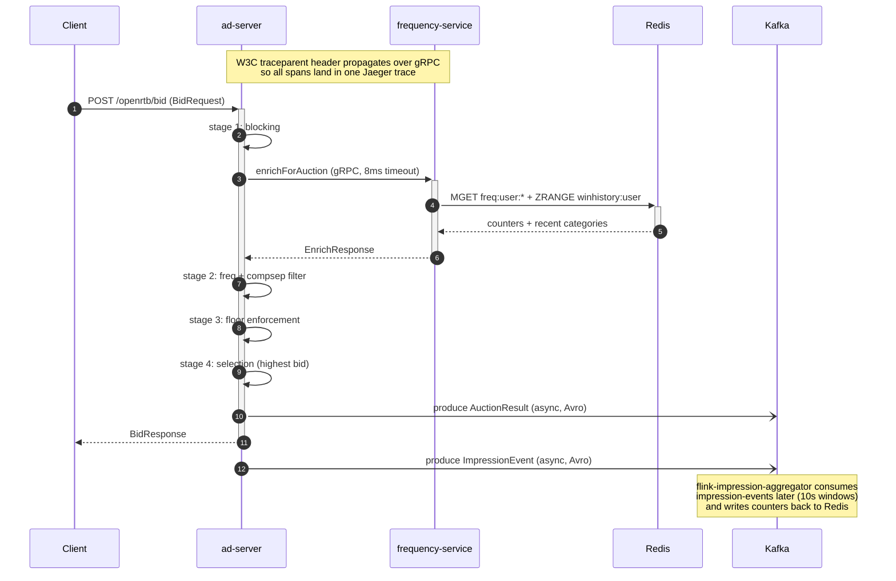

# Phase 6 — Polish + CI Implementation Plan

> **For agentic workers:** REQUIRED SUB-SKILL: Use superpowers:subagent-driven-development (recommended) or superpowers:executing-plans to implement this plan task-by-task. Steps use checkbox (`- [ ]`) syntax for tracking.

**Goal:** Land a recruiter-ready README with four Mermaid diagrams and a green GitHub Actions CI badge backed by `./gradlew check` running on every push and PR.

**Architecture:** Two self-contained tasks, two commits. Task 1 creates `.github/workflows/ci.yml` (no other file changes). Task 2 rewrites `README.md` top-to-bottom, embedding the four diagrams inline as Mermaid fenced blocks (GitHub renders them natively) and adding the CI badge under the title.

**Tech Stack:** GitHub Actions, `gradle/actions/setup-gradle@v4`, Eclipse Temurin 21, Mermaid (built-in GitHub rendering).

**Spec:** [`docs/superpowers/specs/2026-05-06-phase-6-polish-design.md`](../specs/2026-05-06-phase-6-polish-design.md)

**Branch:** `f6` (already cut from `main` after Phase 5 PR merge; spec already committed on `f6`).

---

## File Structure

| File | Action | Owner |
|---|---|---|
| `.github/workflows/ci.yml` | Create | Task 1 — single GH Actions workflow, single job, runs `./gradlew check` |
| `README.md` | Rewrite | Task 2 — top-to-bottom new structure with 4 Mermaid diagrams + CI badge |

No application code, build files, or test code changes. No script changes (`scripts/smoke-test.sh` banner is current).

---

## Task 1: GitHub Actions CI Workflow

**Files:**
- Create: `.github/workflows/ci.yml`

- [ ] **Step 1: Create the workflow file**

Create `.github/workflows/ci.yml` with these exact contents:

```yaml
name: CI

on:
  push:
  pull_request:

concurrency:
  group: ${{ github.workflow }}-${{ github.ref }}
  cancel-in-progress: true

jobs:
  build:
    name: build + test + ktlint
    runs-on: ubuntu-latest
    timeout-minutes: 30

    steps:
      - name: Checkout
        uses: actions/checkout@v4

      - name: Validate Gradle wrapper
        uses: gradle/actions/wrapper-validation@v4

      - name: Set up JDK 21
        uses: actions/setup-java@v4
        with:
          distribution: temurin
          java-version: '21'

      - name: Set up Gradle
        uses: gradle/actions/setup-gradle@v4

      - name: Run check (test + ktlint)
        run: ./gradlew check

      - name: Upload test + ktlint reports on failure
        if: failure()
        uses: actions/upload-artifact@v4
        with:
          name: test-and-lint-reports
          path: |
            **/build/reports/tests/**
            **/build/reports/ktlint/**
          retention-days: 7
          if-no-files-found: ignore
```

- [ ] **Step 2: YAML sanity check**

Run: `python3 -c "import yaml; yaml.safe_load(open('.github/workflows/ci.yml'))" && echo "YAML OK"`
Expected: `YAML OK`

(If `python3` isn't available, skip — GitHub will surface YAML errors on push.)

- [ ] **Step 3: Verify file location and contents**

Run: `ls -la .github/workflows/ci.yml && head -3 .github/workflows/ci.yml`
Expected:
```
-rw-r--r-- ... .github/workflows/ci.yml
name: CI

on:
```

- [ ] **Step 4: Commit**

```bash
git add .github/workflows/ci.yml
git commit -m "Phase 6 task 1: GitHub Actions CI workflow (test + ktlint on push and PR)"
```

(Verification of the workflow itself happens in Step 7 of Task 2 — once the README rewrite lands and we push the branch, the first run is the live check.)

---

## Task 2: README Top-to-Bottom Rewrite

**Files:**
- Modify (full rewrite): `README.md`

This task replaces the entire README. The new file embeds four Mermaid diagrams that GitHub renders natively in fenced ` ```mermaid ` blocks. Spec section references: 2 (structure), 3 (diagrams), 4 (CI), 8 (done criteria).

- [ ] **Step 1: Replace `README.md` with the new content**

Overwrite `README.md` with these exact contents (no prior content survives):

```markdown
# kotlin_ad_server

[](https://github.com/rubinder/kotlin_ad_server/actions/workflows/ci.yml)

A Kotlin-based ad serving runtime: OpenRTB 2.6 (subset) auctions over a 5-stage rule engine, with a fail-open gRPC frequency service, Kafka + Flink closing the impression event loop, and full observability (Prometheus + Grafana + Jaeger). Built as a portfolio project to demonstrate idiomatic Kotlin coroutines and an ad-tech-authentic architecture.

Full design spec: [`docs/superpowers/specs/2026-05-04-kotlin-ad-server-design.md`](docs/superpowers/specs/2026-05-04-kotlin-ad-server-design.md)

## Architecture



`ad-server` (Ktor) is the request hot path. It hydrates inventory from Postgres at boot and serves bid requests from in-memory state. The only network call on the hot path is a single gRPC enrichment call to `frequency-service` (Lettuce → Redis), with an 8 ms timeout and fail-open fallback. After serving a bid, ad-server fire-and-forgets two Kafka events; `flink-impression-aggregator` consumes one of them and updates Redis counters in 10-second tumbling event-time windows. All three services emit Prometheus metrics, OTLP traces to Jaeger, and structured JSON logs with W3C trace correlation.

## Modules

- **`common-protocol`** — OpenRTB 2.6 subset DTOs (BidRequest, BidResponse, Imp, Banner, Site, Device, User) plus gRPC + Avro generated classes shared by the services.
- **`inventory-loader`** — Postgres schema (Flyway migrations) + boot-time loader that produces the `InventorySnapshot`. ~50 sample campaigns.
- **`ad-server`** — Ktor service exposing `POST /openrtb/bid`. Hosts the 5-stage rule engine. Calls frequency-service via gRPC and produces Kafka events.
- **`frequency-service`** — Standalone gRPC service (port 9090) backed by Lettuce → Redis. Owns per-user impression counters and recent-win history.
- **`flink-impression-aggregator`** — Apache Flink 1.20 streaming job. Consumes `impression-events` (Avro via Confluent Schema Registry), keys by `(user, campaign)`, tumbling 10 s event-time windows, writes counts back to Redis through Lua-scripted atomic INCRBY+EXPIRE.
- **`load-test`** — Gatling Kotlin DSL load scenarios (RampUp / Burst / Soak / FailFreq).

## Rule Engine



The hot path runs four filtering stages followed by a selection stage. Each stage emits an `adserver.stage.duration` Timer tagged by stage and an `adserver.candidates.surviving` DistributionSummary so that drop-off at each step is visible in Grafana.

| # | Stage | What it does |
|---|---|---|
| 1 | Blocking | Removes campaigns whose category or domain is in the request's blocklist. |
| 2 | Frequency + Compsep | Calls `frequency-service` over gRPC for per-user counts and recent categories. Drops campaigns at or above their cap, plus competitive-separation neighbors. |
| 3 | Floor | Drops campaigns whose bid is below the request's floor price. |
| 4 | Selection | Picks the highest-priced surviving bid; random tiebreak. |

The frequency call is the only network hop on the hot path. It enforces an 8 ms timeout and falls back to an empty enrichment response on any failure, per spec section 5.4 ("latency wins, freshness loses").

## Kafka Topology



| Topic | Key | Value | Producer | Consumer |
|---|---|---|---|---|
| `auction-results` | `auctionId` | `AuctionResult` (Avro) | ad-server | (none in demo) |
| `impression-events` | `userId` | `ImpressionEvent` (Avro) | ad-server | flink-impression-aggregator |

`auction-results` is currently produce-only — it exists to demonstrate the wider analytics shape but no demo consumer is wired up. `impression-events` closes the feedback loop: Flink reads it, aggregates by `(user, campaign)` over 10-second tumbling event-time windows, and writes counts back to Redis where `frequency-service` reads them on the next bid.

Avro schemas live in `common-protocol/src/main/avro/`. Confluent Schema Registry runs at `localhost:8081` in the docker-compose stack.

## Request Lifecycle



## Run locally

```bash
docker compose up -d
./scripts/kafka-init-topics.sh

# Run the frequency service (terminal 1)
./gradlew :frequency-service:run

# Run the Flink aggregator (terminal 2)
./gradlew :flink-impression-aggregator:run

# Run the ad-server (terminal 3)
./gradlew :ad-server:run

# Send a bid request (terminal 4)
curl -X POST http://localhost:8080/openrtb/bid \
    -H "Content-Type: application/json" \
    -d '{
        "id": "demo-1",
        "imp": [{ "id": "1", "banner": { "w": 300, "h": 250 } }],
        "user": { "id": "demo-user" }
    }'
```

## Observability

`docker compose up -d` brings up Prometheus, Grafana, and Jaeger alongside the rest.

- ad-server `/metrics` — http://localhost:8080/metrics
- frequency-service `/metrics` — http://localhost:9091/metrics
- Prometheus targets — http://localhost:9090/targets
- Grafana dashboard — http://localhost:3000/d/kotlin-ad-server (anonymous admin)
- Jaeger UI — http://localhost:16686

Headline metrics:

| Metric | Type | Tags | Source |
|---|---|---|---|
| `adserver.request.duration` | Timer (histogram) | `outcome` | ad-server |
| `adserver.stage.duration` | Timer (histogram) | `stage` | ad-server |
| `adserver.candidates.surviving` | DistributionSummary | `stage` | ad-server |
| `frequency.grpc.duration` | Timer (histogram) | `outcome` | ad-server |
| `kafka.producer.send.duration` | Timer (histogram) | `topic` | ad-server |
| `inventory.snapshot.size` | Gauge | — | ad-server |
| `inventory.snapshot.age_seconds` | Gauge | — | ad-server |
| `redis.lookup.duration` | Timer (histogram) | `op` | frequency-service |

Both services emit JSON logs via `logstash-logback-encoder`, with `trace_id` / `span_id` auto-injected into MDC by `opentelemetry-logback-mdc-1.0`. Every log line correlates to its trace.

## Load testing

Four Gatling Kotlin DSL scenarios in the `:load-test` module:

| Scenario | Profile | Goal |
|---|---|---|
| `RampUp` | 0 → 5K QPS over 5 min, then 5 min steady | sustained-load latency baseline |
| `Burst` | 1K baseline / 5K spike, 3 cycles | tail latency under load transitions |
| `Soak` | 3K QPS for 30 min | memory leaks, pool exhaustion |
| `FailFreq` | 5K QPS while frequency-service is killed | fail-open behavior under load |

Run: `./scripts/load-test.sh RampUp docs/load-test/baseline-run` (after `docker compose up -d` and the three service `./gradlew :*:run`).

### Profiling: before / after

We profiled the baseline RampUp at 5K QPS with [async-profiler](https://github.com/async-profiler/async-profiler). The flame graph showed `Dispatchers.IO` frames dominating the freq-RPC path — a leftover from Phase 2 where `withContext(Dispatchers.IO)` was added around `withTimeout` to dodge `kotlinx.coroutines.test`'s virtual-time scheduler. In production this forced a context switch per RPC.

The fix (Phase 5 Task 10): removed the wrap, switched the affected tests to `runBlocking`. Detailed results in [docs/load-test/baseline.md](docs/load-test/baseline.md) and [docs/load-test/after.md](docs/load-test/after.md), including flame graphs.

## CI

Every push and PR runs `./gradlew check` (test + ktlint) on Ubuntu (`ubuntu-latest`) with JDK 21. The first run is cold and takes ~6–10 min (Testcontainers spins up Postgres / Redis / Kafka / Schema Registry); subsequent runs hit the Gradle dependency cache and finish in ~3–5 min. Failed runs upload JUnit + ktlint reports as a `test-and-lint-reports` artifact under the run's "Artifacts" panel.

Workflow file: [`.github/workflows/ci.yml`](.github/workflows/ci.yml)

## Testing locally

```bash
./gradlew test                    # full suite (requires Docker for Testcontainers)
./scripts/smoke-test.sh           # alias for the above with a friendly success banner
./scripts/load-test.sh RampUp     # see "Load testing" above
```
```

- [ ] **Step 2: Verify each Mermaid diagram renders**

Open https://mermaid.live in a browser. For each of the four ` ```mermaid ` blocks in `README.md`, copy the diagram body (without the fence markers) into mermaid.live and confirm it renders without errors.

- Diagram 1 (Architecture, `flowchart TB`)
- Diagram 2 (Rule Engine, `flowchart LR`)
- Diagram 3 (Kafka Topology, `flowchart LR`)
- Diagram 4 (Request Lifecycle, `sequenceDiagram`)

If any diagram fails to render, fix the syntax inline and recheck. Common causes: stray markdown characters inside node labels, unbalanced quotes, unsupported sequenceDiagram features.

- [ ] **Step 3: Verify relative links resolve**

Run:
```bash
grep -oE '\]\(([^)]+)\)' README.md | sed -E 's/^\]\((.*)\)$/\1/' | grep -v '^http' | grep -v '^#' | while read p; do
  [ -e "$p" ] && echo "OK   $p" || echo "MISS $p"
done
```

Expected: every printed line starts with `OK`, except `docs/load-test/baseline.md` and `docs/load-test/after.md` which are operator-deferred and may show `MISS`. Those are acceptable; everything else must resolve.

- [ ] **Step 4: Verify smoke test still passes**

Run: `./scripts/smoke-test.sh`
Expected: ends with `==> Phase 1+2+3+4+5 smoke test PASSED. Load test scenarios + profiling toolchain ready.` (Phase 6 doesn't change the smoke test banner — Phase 6 is docs and CI, not test logic.)

- [ ] **Step 5: Commit**

```bash
git add README.md
git commit -m "Phase 6 task 2: README rewrite with 4 Mermaid diagrams + CI badge"
```

- [ ] **Step 6: Push branch and watch CI run**

```bash
git push -u origin f6
```

Then open https://github.com/rubinder/kotlin_ad_server/actions and watch the first CI run for the `f6` branch. Expected: green within ~10 min. If it fails, fix forward in the same PR (don't open a separate PR for CI fixes — the workflow file landed on this branch).

- [ ] **Step 7: Open the PR**

```bash
gh pr create --title "Phase 6: README rewrite + Mermaid diagrams + GitHub Actions CI" --body "$(cat <<'EOF'
## Summary
- Add `.github/workflows/ci.yml` — single job runs `./gradlew check` (test + ktlint) on every push and PR, with Gradle dep caching and wrapper validation. Failed runs upload JUnit + ktlint reports.
- Rewrite `README.md` top-to-bottom: CI badge, four Mermaid diagrams (architecture, rule engine, Kafka topology, request lifecycle), narrative sections for each subsystem.

## Test plan
- [x] Mermaid diagrams render in mermaid.live
- [x] `./scripts/smoke-test.sh` still green locally
- [ ] First CI run on this branch goes green

🤖 Generated with [Claude Code](https://claude.com/claude-code)
EOF
)"
```

---

## Done Criteria (from spec section 8)

- [ ] README renders cleanly on GitHub with all 4 Mermaid diagrams visible (verified by opening the PR's "Files changed" tab and clicking "Display the rendered file" / opening the README on the `f6` branch).
- [ ] CI badge is green on `main` after the first post-merge run.
- [ ] `./scripts/smoke-test.sh` still passes locally.
- [ ] No production source files modified — only `README.md` and the new `.github/workflows/ci.yml`.

## Out of Scope (from spec section 9)

Operator screenshots (Jaeger, Grafana), `docs/load-test/baseline.md` + `after.md`, edge-case test additions, branch protection rules, and any application code changes are explicitly deferred or excluded.
